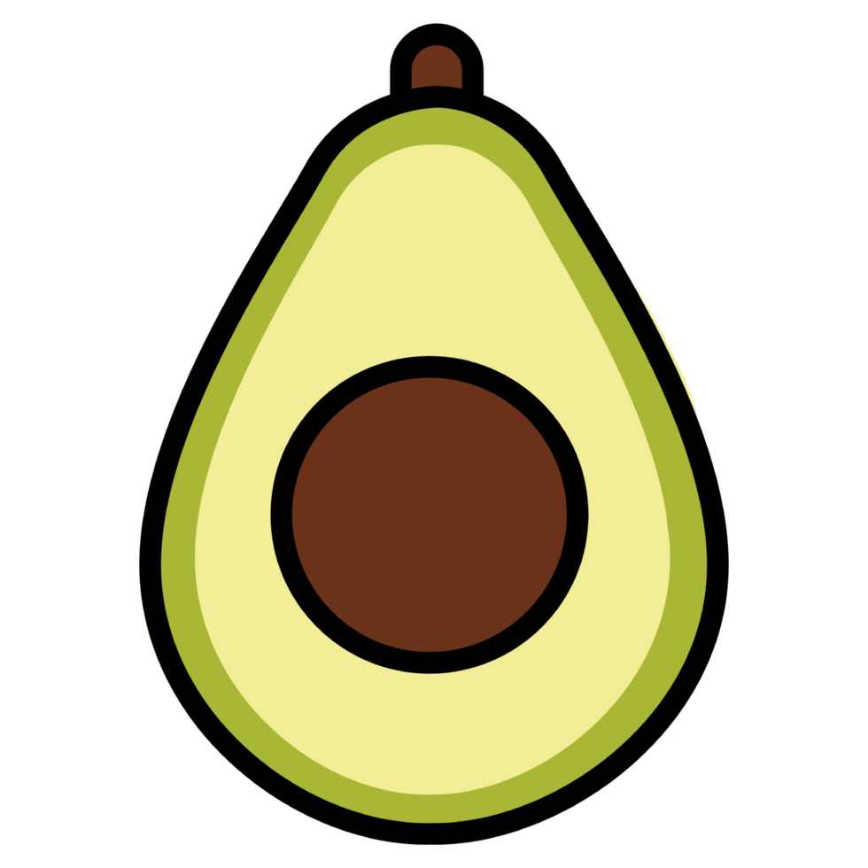

# 🌤️ Contributing to Avo Tiempo | Contribuir a Avo Tiempo 🌈

  
  <h3>Join us to improve the weather experience in the Canary Islands! ✨</h3>
  <h3>¡Únete a nosotros para mejorar la experiencia meteorológica en las Islas Canarias! ✨</h3>

*Read this in: [English](#english) | [Español](#español)*

# English

## 👋 Welcome!

First of all, **thank you for your interest** in contributing to Avo Tiempo! 🎉 

> **We are actively seeking volunteers** who want to help us improve this app and make it even more useful for the Canary Islands community and its visitors.

Any contribution, from bug fixes to new features, from documentation to translations, is greatly appreciated.

## 🚀 How You Can Help

There are many ways to contribute to the project:

- 🐛 **Find and report bugs**
- ✨ **Propose new features**
- 📚 **Improve documentation**
- 🌐 **Add or improve translations**
- 💻 **Write code and fix bugs**
- 🔍 **Review pull requests**
- 🗺️ **Improve local POI data**
- 📱 **Test on different devices**

## 📋 Contribution Process

### 1️⃣ Prepare

- **Fork** the repository
- **Clone** your fork: `git clone https://github.com/your-username/Avo-Tiempo.git`
- **Set up the environment** following the instructions in README.md
- **Create a branch** for your changes: `git checkout -b feature-name`

### 2️⃣ Develop

- 🧹 **Follow the existing code style**
- ✅ **Add tests** for new features
- 📝 **Update documentation** if needed
- 🔄 **Commit often** with clear messages: `git commit -m "Add X to solve Y"`
- 🔍 **Verify** that your code passes all tests: `npm test`

### 3️⃣ Submit

- 🔄 **Update** your branch with the latest changes from the main repository
- ⬆️ **Push** your changes: `git push origin feature-name`
- 📩 **Create a pull request** clearly explaining your changes and their purpose

## 💎 Best Practices

- 📱 **Responsive design**: Make sure your changes work well on all devices
- 🔒 **Security**: Never include API keys or sensitive information in code
- ⚡ **Performance**: Always consider the impact on performance, especially for offline mode
- 🌍 **Accessibility**: Keep the app accessible to all users
- 🗣️ **Internationalization**: Support existing translations

## 🔍 Development Priorities

We are particularly seeking help in these areas:

1. 📍 **POI Data Improvement** - adding more local points of interest
2. 🌡️ **Weather Data Extension** - integrating more data sources
3. 📱 **Testing on iOS/Android devices** - improving the native experience
4. 🤖 **AI Improvements** - making recommendations more accurate and personalized
5. 📄 **Documentation** - improving guides and tutorials

## 🎨 Design and UX

We follow a user-centered design philosophy with a focus on:

- 🌈 **Simplicity and clarity**
- 🖌️ **Local aesthetics** inspired by the Canary Islands
- ⚡ **Quick and intuitive interactions**
- 📱 **Mobile-first experience**

## 📞 Contact Us

Do you have questions or need help?

- 💬 **Open an Issue** on GitHub
- 📧 **Email**: support@avoagency.com
- 🌐 **Discord**: [Join our server](https://discord.gg/avoagency)

---

  <h3>🌟 Thank you for helping make Avo Tiempo better! 🌟</h3>
  
With your help, we can create the best weather and outdoor app for the Canary Islands!

---

# Español

## 👋 ¡Bienvenido!

En primer lugar, **gracias por tu interés** en contribuir a Avo Tiempo! 🎉 

> **Estamos buscando activamente voluntarios** que quieran ayudarnos a mejorar esta aplicación y hacerla aún más útil para la comunidad de las Islas Canarias y sus visitantes.

Cualquier contribución, desde correcciones de errores hasta nuevas funcionalidades, desde documentación hasta traducciones, es enormemente apreciada.

## 🚀 Cómo puedes ayudar

Hay muchas formas de contribuir al proyecto:

- 🐛 **Encontrar y reportar errores**
- ✨ **Proponer nuevas funcionalidades**
- 📚 **Mejorar la documentación**
- 🌐 **Añadir o mejorar traducciones**
- 💻 **Escribir código y corregir errores**
- 🔍 **Revisar pull requests**
- 🗺️ **Mejorar los datos de POI locales**
- 📱 **Probar en diferentes dispositivos**

## 📋 Proceso de contribución

### 1️⃣ Prepararse

- **Fork** del repositorio
- **Clonar** tu fork: `git clone https://github.com/tu-nombre-usuario/Avo-Tiempo.git`
- **Configurar el entorno** siguiendo las instrucciones en README.md
- **Crear una rama** para tus cambios: `git checkout -b nombre-funcionalidad`

### 2️⃣ Desarrollar

- 🧹 **Seguir el estilo de código** existente
- ✅ **Añadir tests** para las nuevas funcionalidades
- 📝 **Actualizar la documentación** si es necesario
- 🔄 **Hacer commits frecuentes** con mensajes claros: `git commit -m "Añade X para resolver Y"`
- 🔍 **Verificar** que tu código pasa todas las pruebas: `npm test`

### 3️⃣ Enviar

- 🔄 **Actualizar** tu rama con los últimos cambios del repositorio principal
- ⬆️ **Push** de tus cambios: `git push origin nombre-funcionalidad`
- 📩 **Crear un pull request** explicando claramente tus cambios y su propósito

## 💎 Mejores Prácticas

- 📱 **Diseño responsive**: Asegúrate de que tus cambios funcionen bien en todos los dispositivos
- 🔒 **Seguridad**: Nunca incluyas claves API o información sensible en el código
- ⚡ **Rendimiento**: Considera siempre el impacto en el rendimiento, especialmente para el modo offline
- 🌍 **Accesibilidad**: Mantén la aplicación accesible para todos los usuarios
- 🗣️ **Internacionalización**: Apoya las traducciones existentes

## 🔍 Prioridades de desarrollo

Estamos especialmente buscando ayuda en estas áreas:

1. 📍 **Mejora de datos POI** - añadir más puntos de interés locales
2. 🌡️ **Extensión de datos meteorológicos** - integrar más fuentes de datos
3. 📱 **Pruebas en dispositivos iOS/Android** - mejorar la experiencia nativa
4. 🤖 **Mejoras de IA** - hacer las recomendaciones más precisas y personalizadas
5. 📄 **Documentación** - mejorar guías y tutoriales

## 🎨 Diseño y UX

Seguimos una filosofía de diseño centrada en el usuario con énfasis en:

- 🌈 **Simplicidad y claridad**
- 🖌️ **Estética local** inspirada en las Islas Canarias
- ⚡ **Interacciones rápidas e intuitivas**
- 📱 **Experiencia mobile-first**

## 📞 Contáctanos

¿Tienes preguntas o necesitas ayuda?

- 💬 **Abre un Issue** en GitHub
- 📧 **Email**: support@avoagency.com
- 🌐 **Discord**: [Únete a nuestro servidor](https://discord.gg/avoagency)

---

  <h3>🌟 ¡Gracias por ayudar a mejorar Avo Tiempo! 🌟</h3>
  
Con tu ayuda, podemos crear la mejor aplicación meteorológica y de actividades al aire libre para las Islas Canarias!

